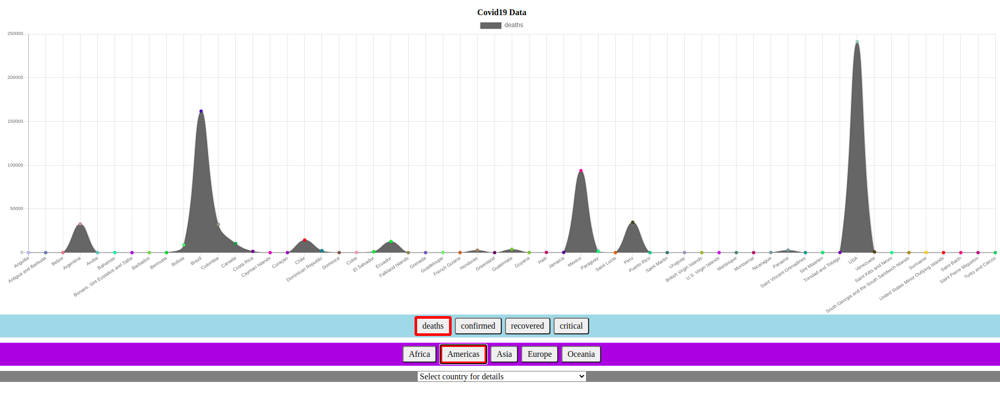

# Covid19_Repo
Go the following link to see the covid 19 graphs:https://sharp-ardinghelli-c1ddb4.netlify.app/ 
(download extension Moesif CORS and turn on to see data, without this an empty page will be displayed)

<ul>
<li>The region is chosen and statistic data of countries in this region can be seen in graph.
The statistics data can be confirmed, deaths, recovered, critical condition of covid19.</li>
The user is choosing which data he would like to see in graph chart.
<li>Each time user clicks on another region the countries updated in dropdown box accordingly to the region</li>
<li>After a country is chosen a statistics is displayed :
  total cases, new cases, total deaths, new deaths, total recovered, in critical condition</li>
  </ul>
  
  
 download extension Moesif CORS and turn on to see data.

